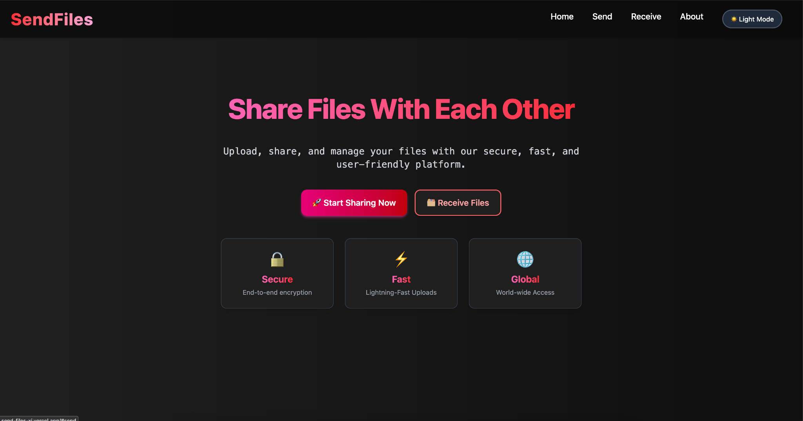

# 📁 SendFiles

SendFiles is a modern, fast, and minimal file sharing application built with the MERN stack. Users can securely send and receive files through unique download codes and links. Files auto-expire after 5 minutes to keep things light and private.

🔗 **Live Website:** [send-files-xi.vercel.app](https://send-files-xi.vercel.app/)\
📁 **GitHub Repo:** [github.com/gargavi-oss/send-files](https://github.com/gargavi-oss/send-files)

---

## ✨ Features

- 🚀 Drag & drop file upload with progress
- 🔐 Unique code-based sharing system
- ⏱ Files auto-delete from DB after 5 minutes
- 📲 Mobile-responsive design
- ✨ QR code generation for easy access
- ✉️ Email sending with Nodemailer
- 🌚 Light/Dark theme toggle
- ⌛ Toast notifications for actions

---

## 🛠️ Tech Stack

### Frontend

- React
- Tailwind CSS
- Framer Motion (animations)
- React Router DOM

### Backend

- Node.js
- Express.js
- MongoDB
- Nodemailer
- Multer (for file uploads)

### Deployment

- **Frontend:** Vercel
- **Backend:** Render

---

## 📷 Screenshots

| Light Mode | Dark Mode |
| ---------- | --------- |
| |           |

*You can add more screenshots for upload, receive, and QR view.*

---

## 🔢 How It Works

1. Upload a file (drag & drop or click)
2. System returns a unique code and a sharable link
3. Share the code/link via email or manually
4. The recipient can download using the code or link
5. File automatically expires after 5 minutes (deleted from DB)

---

## 🚀 Getting Started Locally

```bash
# Clone the repository
https://github.com/gargavi-oss/send-files.git

# Install backend dependencies
cd backend
npm install

# Start backend server
npm run start

# Install frontend dependencies
cd frontend
npm install

# Start frontend
npm run dev
```

> Make sure you create a `.env` file in the root directory for backend configuration (Mongo URI, email credentials, etc.)

---

## 🚜 Roadmap

-

---

## ✅ License

This project is licensed under the MIT License.

---

Made with ❤️ by [Avi Garg](https://github.com/gargavi-oss)
